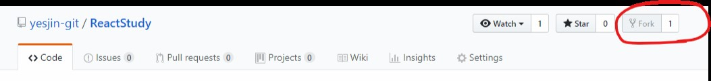
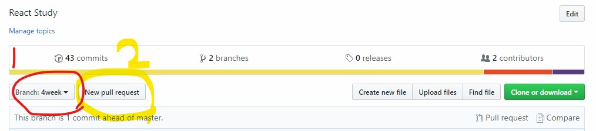
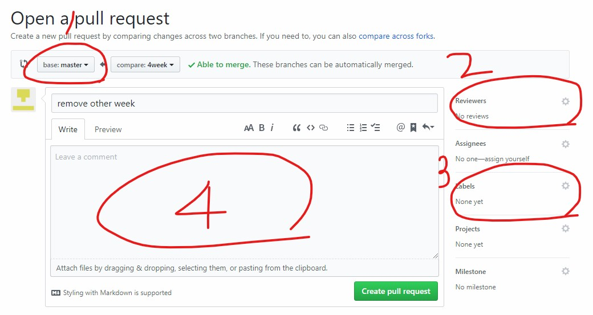

--
typora-copy-images-to: assets
---

# Intro

수강생 여러분 반갑습니다! 수강해주셔서 감사합니다.

* 지금 사이트를 통해 수업 전 간단하게 예습하시거나 복습하실 수 있는 자료를 미리 보실 수 있습니다.  
* 해당 주차에 맞는 교육 자료를 보시고, 수업 및 과제를 준비해 오시길 권장드립니다. 
* Material은 수업 직전에 한번 훑어 보고 오시거나, 수업 시간에 놓친 부분이 있으면 보시고 따라오시면 학습에 큰 도움이 되실 겁니다.
* 문의사항이나 어려운 점, 질문 및 개선사항이 있으시면 꼭 Slack을 통해 말씀해 주시기 바랍니다.

## 교육자료 소개

좌측의 주차와, 내용에 따라 클릭해서 파일을 보시면 됩니다.

* Preview
수업 시작 전 참고할 수 있는 자료입니다. 수업을 시작하기에 앞서 해당 주차에 배울 내용을 간단하게 먼저 소개해 드립니다.
* Material
수업 시간에 활용할 수 있는 교육자료 입니다. 수업 때 실제 다루는 내용과 흐름에 대해 
 정리되어 있습니다.
* Homework
수업 시간에 배운 내용을 응용해 제출하는 과제에 대한 설명과 힌트가 담겨져 있습니다.


## 참고 링크

### 수업 진행 관련
* [Slack](https://1t7-react.slack.com/)
* [수업코드Github](https://github.com/yesjin-git/ReactStudy)

### 참고자료
* [React Book](http://www.realhanbit.co.kr/books/87/pages/974/preview)
* [HTML & CSS](https://www.inflearn.com/course/html-css-%EA%B0%95%EC%A2%8C/)
* [JavaScript](https://programmers.co.kr/learn/courses/3)

## 과제 및 수업진행 / 질문 방법

> 수업시간에 지속적으로 활용될 중요한 부분이니 꼭 잘 참고하고 숙지해 주시기 바랍니다.

1. [수업코드 Github](https://github.com/yesjin-git/ReactStudy)에 들어간다.

2. 해당 수업자료를 Fork한다. 

    

    ​	<깃허브 상단 위의 동그라미 친 버튼을 눌러주세요>

3. cd 명령어로 프로젝트를 관리하고 싶은 폴더로 이동한 뒤에,

     ````console
     git clone https://github.com/<깃아이디>/ReactStudy.git
     ````

     명령어를 통해 포크해온 레포지토리를 클론해 옵니다.

4. 프로젝트 폴더로 이동한 뒤, 해당하는 주차(처음 시작할 경우 1주차)의 branch를 가져온다.

    ```console
    //아주 주의해서 입력합시다.
    git checkout -t origin/<해당주차> ex) git checkout -t origin/1week
    ```

    참고 : https://cjh5414.github.io/get-git-remote-branch/

5. 해당 주차의 폴더에서 수업이나 과제를 진행한두 commit / push로 자기 레포지토리를 업데이트 한다. 

    ```console
     git add . 											(변화가 있는 모든 파일을 staging함)
     git commit -m "과제 1 xxx 구현"	(예시입니다.)
     
     ...(반복)...
     git push
    ```

6. 커밋한 후 해당 과제를 업로드한 뒤 주차에 해당하는 pull request를 보내 리뷰를 기다린다.

    

    1. 먼저 Branch를 해당 주차로 변경한다. (위 이미지에서 4week)

    2. New pull request버튼을 눌러 리퀘스트메시지 창으로 넘어간다.

       

    3. base:부분(1번)에 해당하는 주차를 선택한다.

    4. 우측의 reviewers에 (2번) 톱니버튼을 눌러 선생님 아이디를 등록한다. (yesjin-git, Jravvit)

    5. 하단의 Labels에 과제일 경우 homework, 재량껏 무언가를 한 경우 enhancement, 질문의 경우 question, 문제가 생긴 경우 help wanted 를 선택(중복가능)

    6. 커밋 내용을 입력하는 부분(4)에 tutor에게 전달하고 싶은 내용을 자유롭게 작성

7. 과제를 했음을 슬랙 체널에 알린다.

